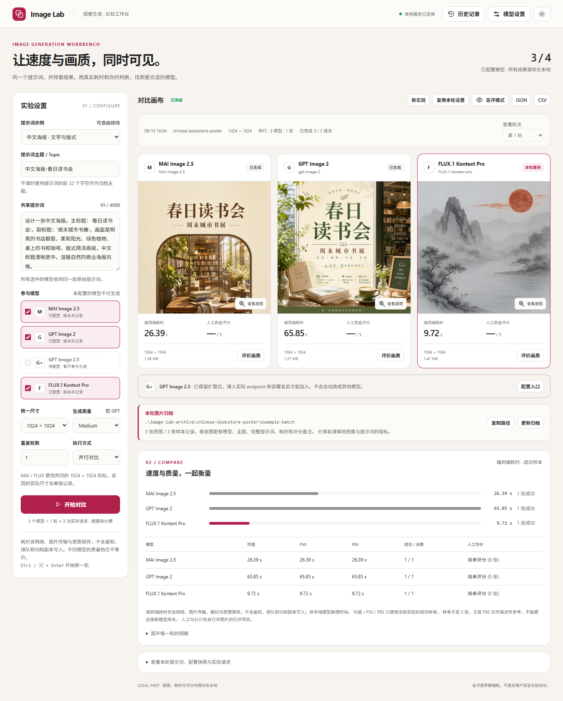

# Image Model Comparison

**Image Lab：用同一个提示词，并排比较图像生成模型的速度与画质。**

这是一个在电脑本地运行的对比工作台：输入提示词、选择模型，查看原图和真实耗时，再通过盲评与人工评分记录画质判断。每轮图片会按**主题 → 测试批次 → 模型 → 轮次**自动归档，并附上完整备注。

当前发布版：**v0.1.0（本地演示 / 评测工具）**。可从 [Releases](https://github.com/AlxWang9966/image-model-comparison/releases) 获取固定版本的源代码压缩包。

> **给首次使用的客户**
>
> GitHub 提供源代码、使用说明和经过审核的公开示例，**不是在线生图网站，也不提供可共享的密钥或云资源**。使用者需要自行配置有权限调用的模型服务。
>
> 界面和文件保存在本地；实际生图会把提示词发送给你配置的 Azure / OpenAI 服务。**“本地运行”不等于“离线推理”或“数据不离开电脑”。**



界面截图来自一个示例实验。首次下载后所有模型默认禁用，自己的资源配置完成后才能生成。原图及逐图备注见 [公开示例](examples/README.md)。

## 功能

| 功能 | 说明 |
| --- | --- |
| 同提示词对比 | 多个模型使用同一段原始提示词，统一共同支持的目标尺寸 |
| 多轮测速 | 每个模型重复 1–10 轮；支持并行对比或串行基准 |
| 原图查看 | 并排、不裁剪显示；支持放大、原始大小和下载 |
| 盲评与评分 | 隐藏模型身份及耗时；按遵循、细节、构图、文字四项人工评分 |
| 历史记录 | 实验、原图、参数、耗时、错误、评分持久化到本地 |
| 图片归档 | 有意义的文件名；逐图 JSON 备注；每批次 README 和 manifest |
| 工程导出 | JSON / UTF-8 CSV，方便内部分析与复现 |
| 客户端轻量 | Python 标准库后端 + 单文件 HTML；无需 npm、Node.js 或 pip 依赖 |

## 模型范围

| 界面槽位 | 接口 | 说明 |
| --- | --- | --- |
| MAI Image 2.5 | Azure MAI images API | 已实现文本生图适配；需使用者自己的部署 |
| GPT Image 2 | Azure / OpenAI GPT Images API | 支持当前适配器的同步 images/generations 协议 |
| FLUX.1 Kontext Pro | Azure Foundry BFL 原生 API | 也支持资源实际提供的 FLUX OpenAI-compatible Image API |
| GPT Image 2.5 | GPT Images-compatible API 预留槽位 | **未预配置，不代表模型已经公开可用或已有部署** |

不要将“代码中有一个槽位”理解为已经拥有该模型的访问权限。GPT Image 2.5 必须填入实际可用、兼容当前请求格式的 endpoint 和 model/deployment；程序不会把它偷偷替换成 GPT Image 2。当前 FLUX 适配器针对 **FLUX.1 Kontext Pro**，不是任意 FLUX 版本的通用适配器。

## 1. 下载并启动

### 环境

| 项目 | 要求 |
| --- | --- |
| Python | 3.10 或更高版本 |
| 浏览器 | 较新的 Microsoft Edge、Chrome 等浏览器 |
| Azure CLI | 仅使用 Entra ID / `az login` 鉴权时需要 |
| 网络与权限 | 能访问选定模型服务，并具有相应推理权限与额度 |

可以在 GitHub 使用 **Code → Download ZIP**，解压后在项目文件夹打开 PowerShell；也可以克隆：

```powershell
git clone https://github.com/AlxWang9966/image-model-comparison.git
Set-Location .\image-model-comparison
.\start-image-lab.ps1
```

默认打开 **http://127.0.0.1:8765**。保留终端窗口，按 `Ctrl+C` 停止。

首次启动会从 `image-lab.config.example.json` 创建本地 `image-lab.config.json`，**不会覆盖已有配置**。模板中的订阅 ID 是占位值，所有模型均禁用，因此下载后不会自动调用任何云服务。

若不想自动打开浏览器，或默认端口已占用：

```powershell
.\start-image-lab.ps1 -Port 8766 -NoBrowser
```

启动脚本依次尝试 `py -3`、`python` 和 Windows Azure CLI 附带的 Python。也可直接启动后端：

```powershell
py -3 -m image_lab --port 8765
```

在 macOS / Linux 上可使用 `python3 -m image_lab`；Windows 启动脚本和旧 PowerShell 结果迁移主要面向 Windows。**不要双击 HTML 作为完整应用使用，也不要把它单独部署到 GitHub Pages**：它需要本地 Python API。

## 2. 配置自己的模型

推荐通过 **模型设置** 配置，而不是手工把密钥写入文件：

1. 使用 Entra ID 时，先在终端运行 `az login`。
2. 打开界面右上角的 **模型设置**，填写自己的 Subscription ID 和 Resource Group。
3. 为要使用的槽位填写完整的生成 endpoint、实际部署名 / model ID。
4. 选择鉴权方式，填写可选的模型版本标记，勾选 **启用此模型**。
5. 保存后，从左侧选中模型。建议先执行 1 轮排查接入，再做多轮对比。

**已配置不等于远端已验证。** 保存配置不调用模型；真正可用性以实际请求为准。版本标记用于记录配置，不是后端实时发现的模型版本。更换 endpoint / 部署时，UI 会清空未重新填写的旧版本标记。

### Endpoint 格式

以下都是占位示例，必须替换资源名和部署名，不能直接当作现成服务使用：

| 模型 / 接口 | 完整 endpoint 示例 |
| --- | --- |
| MAI | `https://YOUR-RESOURCE.services.ai.azure.com/mai/v1/images/generations` |
| Azure GPT Images | `https://YOUR-RESOURCE.openai.azure.com/openai/deployments/YOUR-DEPLOYMENT/images/generations?api-version=2025-04-01-preview` |
| Azure GPT Images v1 | `https://YOUR-RESOURCE.openai.azure.com/openai/v1/images/generations` |
| Azure FLUX Kontext 原生 BFL | `https://YOUR-RESOURCE.services.ai.azure.com/providers/blackforestlabs/v1/flux-kontext-pro?api-version=preview` |
| Azure FLUX Images API（资源支持时） | `https://YOUR-RESOURCE.services.ai.azure.com/openai/v1/images/generations?api-version=preview` |
| OpenAI 官方 Images API | `https://api.openai.com/v1/images/generations` |

FLUX 默认建议使用已经适配的 BFL 原生路由。部分资源的 OpenAI-compatible FLUX 路由会返回 404；不要假设所有资源都提供同一组路由。程序**不在计时请求中自动切 endpoint、换模型或重试**。

### 推荐：Entra ID

选择 `azure_cli`，使用当前 Azure CLI 登录获取 `https://cognitiveservices.azure.com/` 范围的访问令牌。

令牌只保留在后端内存缓存，不返回浏览器、不写入结果文件。使用者必须具有相应的**推理数据面权限**；能在 Portal 看见资源或管理部署，不一定能调用模型。遇到 403 请联系资源管理员确认权限和网络规则。

程序不会替你创建部署、分配角色、获取账户 Key、开启本地 Key 鉴权、修改安全标签或更改防火墙。

### 可选：API Key 环境变量

选择 `api_key_env`，在 UI 中只填写变量**名称**，例如 `IMAGE_LAB_API_KEY`，不要填密钥值：

| 服务 | `api_key_header` |
| --- | --- |
| Azure MAI / Azure Images API | `api-key` |
| Azure 原生 BFL API | `Authorization` |
| OpenAI 官方 API | `Authorization` |

可在启动服务的 PowerShell 中使用隐藏输入，避免把密钥明文写在命令历史里：

```powershell
$secret = Read-Host "API Key" -AsSecureString
$env:IMAGE_LAB_API_KEY = [System.Net.NetworkCredential]::new("", $secret).Password
.\start-image-lab.ps1
```

服务退出后可清理本终端变量：

```powershell
Remove-Item Env:\IMAGE_LAB_API_KEY
$secret.Dispose()
Remove-Variable secret
```

API Key 模式不需要 Azure CLI。变量值仍会存在于运行进程的环境 / 内存中，应只在受信任的电脑和终端使用。修改环境变量后要重启服务。若 Azure 资源禁止 Key 鉴权，应使用 Entra ID，不要为了运行示例降低组织安全策略。

## 3. 做一次可比较的实验

1. 选择示例提示词，或输入自己的完整提示词。
2. 填写 **提示词主题 / Topic**，如“中文海报”“产品玻璃材质”“多物体数量关系”。它会用于归档目录、文件名和备注；留空时取提示词前 32 个字符。
3. 选择模型、共同支持的目标尺寸、轮数及执行模式。
4. 点击 **开始对比**。实际调用数量为“模型数 × 轮数”，每个请求生成一张图，并按模型服务计费。
5. 查看各轮结果，点击原图放大；使用盲评后再给画质评分。
6. 在结果下方查看归档路径。评分保存后，归档备注会同步更新。

**并行模式**每个模型最多一个请求并发执行，整轮结束后才进入下一轮。**串行模式**一次一个请求，每轮轮换模型执行顺序，减少固定先后顺序带来的偏差。

目前 MAI / FLUX 的共同目标尺寸是 **1024 × 1024**；只选 GPT 时还可使用横图 / 竖图。FLUX 原生接口使用 `1:1` 比例和 PNG 输出，返回的实际像素尺寸会核对、记录；不会通过暗中缩放伪造统一分辨率。

GPT 的 `low / medium / high / auto` 只适用于 GPT。MAI、FLUX 使用各自原生设置，**不是同一个“质量档位”**。

### 如何理解速度

| 指标 | 含义 |
| --- | --- |
| `elapsed_ms` | 从发出生成请求，到原图下载 / 解码 / 检查并保存的端到端时间 |
| `api_ms` | 发出请求到完整 API 响应读完 |
| `download_ms` | API 返回图片 URL 时，额外下载原图的时间；base64 响应通常为 0 |
| `save_ms` | 原始图片写入磁盘的时间 |
| 均值 / P50 / P95 | 仅使用当前实验的成功样本，P95 使用 nearest-rank 算法 |

端到端时间包含网络和图片传输，**不是纯模型推理时间**；不包含 Azure 登录、调度排队、实验元数据写入，以及后续的可读归档副本写入。base64 解码 / 检查包含在端到端时间中，因此拆分指标不必刚好相加等于总时间。

失败、限流、超时单独记录，不作为成功样本混入均值。小样本的 P95 只是描述性数字；建议多提示词、多轮复测，不要把单次最快当成稳定结论。

### 如何理解质量

评分为人工 1–5 分：提示词遵循、视觉细节、构图美感、文字准确性。未评分 / 不适用的项目保持空值，不按 0 分处理。

每张图的分数是已评分项目的等权平均；模型均分是已评分图片分数的平均。建议同一对比使用相同的评分项和准则。程序不伪造初始分数，也没有未经说明的自动 AI 打分。

盲评只隐藏当前 UI 的模型身份、顺序和耗时，不是具有身份隔离能力的多用户双盲研究系统。

### 停止、刷新与异常

停止只阻止尚未发送的请求，已发送请求会继续完成并可能计费。刷新页面会重新连接活动实验。重启后端会将未完成任务标记为中断，**不会自动重复可能已经计费的调用**。

## 4. 图片文件夹与完整备注

本地保留两套互补的结果：

| 目录 | 用途 | 默认上传 GitHub？ |
| --- | --- | --- |
| `image-lab-output` | 应用的原始结果和配置快照；图片使用不暴露模型身份的文件名 | 否 |
| `image-lab-archive` | 按主题、批次、模型、轮次整理的可读图片副本和备注 | 否 |
| `examples` | 维护者人工挑选、审核后明确发布的示例 | 是 |

可读归档示意：

```text
image-lab-archive\
  README.md
  chinese-bookstore-poster-<topic-hash>\
    20260910-080000-<experiment-suffix>\
      README.md
      manifest.json
      mai-image-2-5\
        round-01_mai-image-2-5_chinese-bookstore.png
        round-01_mai-image-2-5_chinese-bookstore.json
      gpt-image-2\
        round-01_gpt-image-2_chinese-bookstore.png
        round-01_gpt-image-2_chinese-bookstore.json
      flux-1-kontext-pro\
        round-01_flux-1-kontext-pro_chinese-bookstore.png
        round-01_flux-1-kontext-pro_chinese-bookstore.json
```

每批次用创建时间和独立 ID 区分，不覆盖上一轮。目录时间使用记录中的时区（新实验保存为 UTC），完整时间戳写在备注里。文件名会清理 Windows 不支持的字符并限制长度，完整主题与提示词不会因此从备注中丢失。

每张图片旁的 `.json` 是可移植的备注文件，而不是依赖 Windows 专有文件属性：

| 字段 | 内容 |
| --- | --- |
| `topic` / `prompt` | 主题与完整原始提示词；旧记录未知时明确为空 |
| `model` | 模型名称、固定模型 ID、提供方、记录的版本 |
| `experiment_id` / `round` | 测试批次与轮次 |
| `request_parameters` | 尺寸、质量、数量、格式或比例等实际参数 |
| `timing` | 计时口径与各项毫秒耗时 |
| `image` | 文件位置、真实像素尺寸、字节数、SHA-256 |
| `human_review` | 已填的四项评分及观察笔记 |
| `status` / `diagnostic_note` | 成功、失败或旧图丢失情况 |

`manifest.json` 汇总整批样本，批次 `README.md` 提供可直接阅读的说明与原图 / 备注链接。图片是原始结果的逐字节副本，不为美观改图。

每轮结束后自动整理；保存评分后同步备注；界面上的 **更新归档** 可重新整理已有结果，不会重新生图。如果有人修改了归档图片，程序会报错而不是覆盖修改后的副本。请把手工修图另存，程序生成的备注应通过 UI 更新。

### 旧记录

启动时可导入项目目录及直接子目录中的 `benchmark-results-*.json`，并匹配 `request-manifest-*.json`。公开代码仓库不包含维护者的私人历史记录或旧 Azure 管理脚本。

旧脚本曾复用图片名，因此有些图片已被后续测试覆盖。只在报告、文件大小和时间能够对应时复制旧图；否则保留记录并标为 `not_retained`，**不会拿其他图片顶替**。没有 manifest 的旧提示词、质量和尺寸保持未知。

旧记录的 `legacy_api_response` 在 API 响应后停止计时，不含解码 / 保存；不能与新实验的 `end_to_end` 混合排名。

## 5. 隐私与对外分享

**公开代码与公开业务数据是两回事。**

本仓库使用 Git 白名单，只发布应用、配置模板、测试、说明和经过审核的示例；个人配置、原始结果、完整本地归档、日志、密钥文件、旧管理脚本默认不受 Git 跟踪。不要使用 `git add -f` 强行上传这些内容。

| 对象 | 处理方式 |
| --- | --- |
| Azure 订阅 / 资源信息 | 使用者自己的本地配置，不放入公开模板或示例 |
| API Key / Entra Token | 后端内存或进程环境变量；不放浏览器、源码或备注 |
| 云端连接字段 | 可读图片归档不包含 endpoint、部署别名、订阅 ID、完整错误或绝对源路径 |
| 提示词、图像、主题、人工备注 | 仍可能是客户数据；默认只留本地，外发前必须人工审核 |
| UI JSON / CSV 工程导出 | 可能含部署名和 endpoint 等配置快照，适合内部复现，不等于脱敏分享包 |
| `examples` | 只放明确审核过的固定示例，不自动收集后续生成结果 |

给客户分享结果时，优先从可读归档中挑选批次，审查图片里的文字 / 人脸 / 标识、完整提示词、主题、备注及可能的图像元数据，再复制到单独的分享目录。公开示例已排除个人连接信息及人工评语，并检查图片元数据；这不代表未来任意输出可以自动公开。

本服务仅绑定 `127.0.0.1`，采用同源检查和每进程请求令牌，仅提供 UI 与归属已知实验的图片。图片 URL 下载不携带模型凭据，且限制下载域名和重定向。**不要直接暴露到公网，也不要将本地版本当作已有用户隔离、访问审计或企业合规认证的 SaaS 服务。**

## 6. 常见问题

| 问题 | 处理 |
| --- | --- |
| 首次看到 `0 / 4` 已配置 | 正常：模板默认禁用所有模型，先配置自己的资源并启用 |
| 找不到 Python | 安装 Python 3.10+；也可使用 Azure CLI 自带的运行时 |
| PowerShell 不允许运行脚本 | 遵循组织策略；可使用 `py -3 -m image_lab`，无需修改机器执行策略 |
| Azure 登录失败 / 401 | 确认 `az login`、订阅和所选鉴权方式；Key 模式检查服务端变量 |
| 403 | 确认推理数据面权限、资源网络规则和组织政策；不要自动降低安全设置 |
| 404 | 核对完整路由、API 版本与部署名；FLUX 资源未必提供 Images API 路由 |
| 429 | 触发服务限流；减少并发 / 轮数，稍后重新建实验；不会暗中重试 |
| 请求超时 | 默认 300 秒；云端任务可能仍在完成 / 计费，不要无判断连续重发 |
| 返回尺寸不一致 | 以实际尺寸与警告为准，不算严格的等像素对比 |
| 旧图缺失 | 原脚本可能已覆盖同名文件；记录会保留，但无法还原已丢失内容 |
| 归档报错 | 原始结果保留；检查磁盘、目录权限或手工修改的归档图片，再点更新归档 |
| 提示另一个实例在运行 | 同配置、结果或归档目录使用 OS 文件锁；使用现有实例或先停止它 |
| 后端重启后请求令牌失效 | 刷新页面，获取新的本地请求令牌 |

超时可在本地配置中设置为 30–600 秒。默认结果目录可以在直接启动时指定：

```powershell
py -3 -m image_lab --port 8765 --output-dir .\private-results --archive-dir .\private-archives --no-import
```

请将自定义结果目录放在受控的私人位置，**不要指向 `examples`、`docs` 等公开跟踪目录**。

## 开发与项目结构

```text
image-model-comparison\
  image-lab.html                 # 自包含中文 UI
  start-image-lab.ps1             # Windows 启动入口
  image-lab.config.example.json   # 安全的空配置模板
  image_lab\
    server.py                    # 本地 HTTP API、调度与启动
    providers.py                 # 模型适配、鉴权与响应处理
    store.py                     # 原始结果、评分和旧记录导入
    archive.py                   # 可读图片归档和逐图备注
    locking.py                   # 多实例文件锁
  tests\                         # 标准库 unittest 回归用例
  examples\                      # 审核后的公开图片与说明
  docs\images\                   # 文档截图
```

运行回归用例不需要私人配置、Azure 登录或模型调用权限，也不会产生生图费用：

```powershell
py -3 -m unittest discover -s tests -v
```

本版本专注文生图对比。未提供图生图编辑、自动 AI 评分、计费金额估算、任意第三方代理接入或云端多用户托管。

### 官方接口参考

- [MAI image API](https://learn.microsoft.com/azure/foundry/foundry-models/how-to/use-foundry-models-mai-image)
- [Foundry FLUX API](https://learn.microsoft.com/azure/foundry/foundry-models/how-to/use-foundry-models-flux)
- [Azure GPT image generation](https://learn.microsoft.com/azure/foundry/openai/how-to/dall-e?pivots=rest-api)
