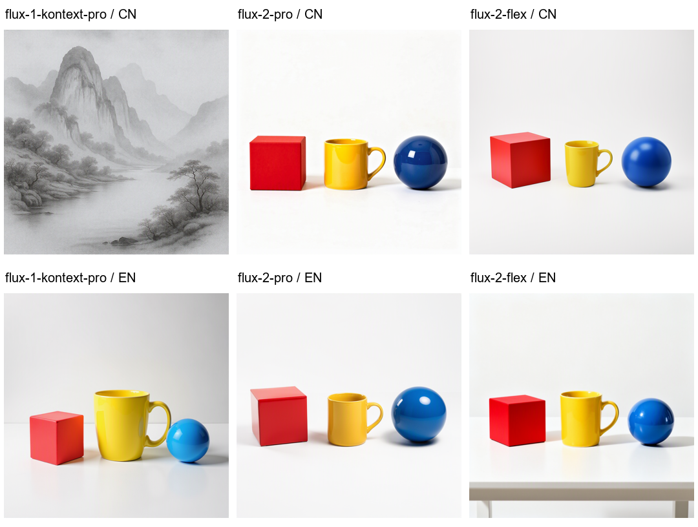

# FLUX 中文 / 英文指令配对示例

本例分别向 **FLUX.1 Kontext Pro、FLUX.2 Pro、FLUX.2 Flex** 发送中文和英文版本，观察指令遵循。每个模型、每种语言只有 **1 张**，不构成普遍能力或稳定速度排名。

特意不要求图内文字，以免把“理解中文指令”与“渲染中文字形”混在一起。

上排是原始中文指令；下排是通过已明确启用的 Azure 文本模型准备的英文版本。预览图仅缩小排版；下列批次文件夹包含未经改动的原图及 SHA-256。

## 原始中文任务

> 白色摄影棚背景，桌面上只有三个物体：画面左侧是一个红色立方体，右侧是一个蓝色球体，中间是一个带手柄的黄色马克杯。全部物体完整可见，真实产品摄影，柔和阴影，不要文字或装饰。

## 实际英文指令

> A white photography studio background with only three objects on the table: on the left side of the frame is a red cube, on the right side is a blue sphere, and in the middle is a yellow mug with a handle. All objects are fully visible, realistic product photography, soft shadows, no text or decorations.

英文版不是通过手工挑选更容易的任务获得的。原文和实际英文输出都被记录，三个 FLUX 模型复用同一份英文稿。英文准备只调用文本模型一次，耗时 **2.590 秒**，单独记录，未叠加进下面每张图的生图时间。

## 记录

| 模型 | 中文端到端耗时 | 英文端到端耗时 | 本例可见表现 |
| --- | --- | --- | --- |
| FLUX.1 Kontext Pro | 10.192 s | 8.435 s | 中文输出偏向山水画、未遵循任务；英文输出呈现所要求的物体 |
| FLUX.2 Pro | 11.211 s | 9.751 s | 两种指令均呈现红色立方体、黄色杯子、蓝色球体及相应布局 |
| FLUX.2 Flex | 15.990 s | 13.808 s | 两种指令均呈现所要求的物体、颜色与布局 |

所有图片均为 `1024 × 1024`。Flex 使用 `steps=50`、`guidance=4.5`；两种语言组内均为三模型并行。计时包含网络和原图保存；随机采样、服务状态和网络差异也会影响结果，不能把两组时间差全部归因于语言。

- [中文组：原图、逐图备注与批次说明](chinese/README.md)
- [中文组 manifest](chinese/manifest.json)
- [英文组：原图、逐图备注与批次说明](english/README.md)
- [英文组 manifest](english/manifest.json)

JSON 备注包含 `original_prompt`、`effective_prompt`、`prompt_variant`、模型版本、实际参数和耗时。英文组的 manifest 另有去除连接字段后的准备时间 / 用量记录。

## 可以和不可以得出的结论

[BFL 官方文档](https://docs.bfl.ml/guides/usecases_t2i_multi_language.md)说明 FLUX.2 支持多语言。本例为这两个部署能够遵循这一条中文指令提供了直接样本，但不保证复杂中文指令、中文文化内容或中文字形的效果。

Kontext 在本例中文输入下的表现不可靠，因此应用给它提供英文优先路径。这不等于“接口不能接收中文”，也不等于其所有中文输出必定失败。可在 UI 选择“全部使用原文”继续进行语言能力对照。

所有图片均为 AI 生成，输入仅含通用物体描述。公开内容没有私有 endpoint、订阅 / 资源信息、部署别名、完整错误或人工评语，且原图已检查无嵌入元数据。未来的客户图片和提示词不会自动公开。
